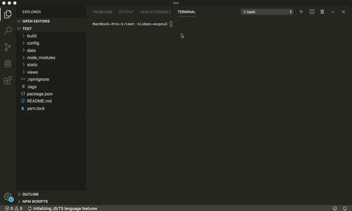
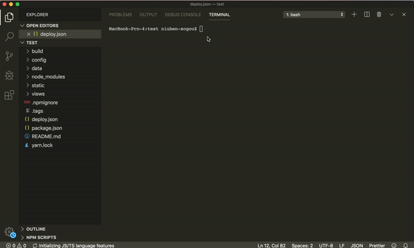

## shell-deploy
使用配置文件完成代码部署


### 快速开始
使用`shell-deploy`模块分为三步
1. 安装模块
2. 创建部署流程
3. 执行部署命令


#### 1.安装模块
```js
npm add shell-deploy
```

#### 2.创建部署流程

执行创建命令
```js
npx shell-deploy --create    
```
按照命令选择每一步内容

最终会生成一个`deploy.json`的配置文件, 同时会在`package`中创建相应的命令

#### 3.执行部署命令

运行
```js
npm run preview //部署到预览环境
npm run online //部署到预览环境
```





### API描述

每个场景都是一个`key/value`形式，`key`是场景名称，`value`是一个数组包含部署每一个步骤;
比如下面配置文件，有`preview`和`online`两个场景;
```
{
    "preview":[{
        "type": "command",
        "command": "yarn run test"
    },{
        "type": "upload",
        "host": "10.152.81.208",
        "username": "root",
        "password": "****",
        "path": "/usr/local/***",
        "source": "./test/**"
    }], 
    "online": [{
        "type": "copy",
        "source": "./test/test1/a.js",
        "dest": "./test/test2"
    },{
        "type": "git-commit"    
    }]
}
```


API列表:
* upload
* command
* copy
* cd 
* delete
* git-pull
* git-commit

通用字段：
* title: 说明当前步骤是什么

#### upload
将文件上传到服务器上, 对应字段如下
* host: 服务器地址（可以是IP地址）
* username: 用户名
* password: 密码
* path: 指定服务器上传路径
* source: 需要上传的文件路径

```js
{
    "type": "upload",
    "host": "10.152.81.208",
    "username": "root",
    "password": "****",
    "path": "/usr/local/***",
    "source": "./test/**"
}
```

#### command 
需要执行的命令
* command: 命令名称

```js
{
    "type": "command",
    "command": "yarn run test"
}
```

#### copy
复制文件和文件夹

* source: 需要复制文件和文件夹路径
* dest: 目标路径

```js
{
    "type": "copy",  
    "source": "./test/test1/a.js",
    "dest": "./test/test2"
}
```

#### cd
进入指定文件夹路径
* path: 指定文件夹路径

```js
{
    "type": "cd",
    "path": "../test/" 
}
```

#### delete
删除指定文件或者文件夹


#### create
创建指定文件或者文件夹


#### git-pull
通过`git pull`拉取代码

```js
{
    "type": "git-pull"
}
```

#### git-commit 
通过`git commit`提交代码

* message: 提交的文案; 如果这个字段不存在，会自动提示填写字段;
```js
{
    "type": "git-commit"
    "message": "修改xxx文件"
}
```
